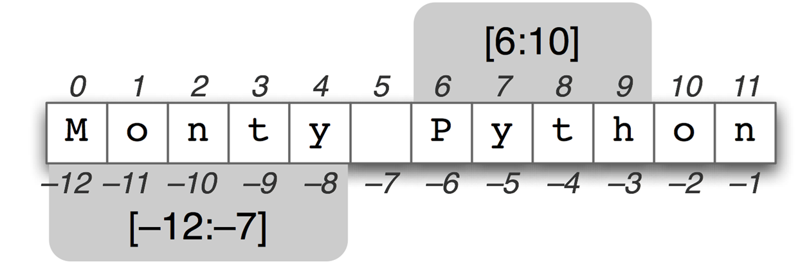

<BR>

|:-------:|
| <span style="font-size: 100%"><b>_-- A Python Course for the Humanities by Folgert Karsdorp and Maarten van Gompel_</b></span>|

# String Manipulation

Many disciplines within the humanities work on texts. Quite naturally programming for the humanities will focus a lot on manipulating texts. In the last quiz you were asked to define a variable that points to a string that represents your name. We have already seen some basic arithmetic in our very first calculation. Not only numbers, but also strings can be added, or, more precisely, concatenated, together as well:

```python runnable
name = "Grace Hopper"

book = "The Lord of the Flies"
print(name + " likes " + book + "?")
```
<BR>

This string consists of a number of characters. We can access the individual characters with the help of `indexing`. For example, to find only the first letter of your name, you can type in:

```python runnable
name = "Grace Hopper"

first_letter = name[0]
print(first_letter)
```

<BR>

Notice that to access the first letter, we use the index `0`. This might seem odd, but just remember that indexes in Python start at zero.

# Quiz!

Now, if you know the length of your name you can ask for the last letter of your name:

```python runnable
name = "Grace Hopper"

last_letter = name[# fill in the last index of the name above (tip indexes start at 0)]
print(last_letter)
```

<BR>

It is rather inconvenient having to know how long our strings are if we want to find out what its last letter is. Python provides a simple way of accessing a string from the rear:

```python runnable
name = "Grace Hopper"

last_letter = name[-1]
print(last_letter)
```

<BR>

Alternatively, there is the function `len()` which returns the length of a string:

```python runnable
name = "Grace Hopper"

print(len(name))
```

<BR>

Do you understand the following?

```python runnable
name = "Grace Hopper"

print(name[len(name)-1])
```

<BR>

# Quiz!

Now can you write some code that defines a variable `but_last_letter` and assign to it the second-to-last letter of your name?

```python runnable
name = "Grace Hopper"

but_last_letter = # insert your code here
print(but_last_letter)
```

<BR>


You're starting to become a real expert in indexing strings. Now what if we would like to find out what the last two or three letters of our name are? In Python we can use so-called slice-indexes or slices for short. To find the first two letters of our name we type in:

```python runnable
name = "Grace Hopper"

first_two_letters = name[0:2]
print(first_two_letters)
```

<BR>

The `0` index is optional, so we could just as well type in `name[:2]`. This says take all characters of name until you reach index 2. We can also start at index 2 and leave the end index unspecified:

```python runnable
name = "Grace Hopper"

without_first_two_letters = name[2:]
print(without_first_two_letters)
```

<BR>


Because we did not specify the end index, Python continues until it reaches the end of our string. If we would like to find out what the last two letters of our name are, we can type in:

```python runnable
name = "Grace Hopper"

last_two_letters = name[-2:]
print(last_two_letters)
```

<BR>

Take a look at the following picture. Do you fully understand it?




----

[Python Programming for the Humanities](http://fbkarsdorp.github.io/python-course) is licensed under a [Creative Commons Attribution-ShareAlike 4.0 International License](https://creativecommons.org/licenses/by-sa/4.0/). Based on a work at https://github.com/fbkarsdorp/python-course.


