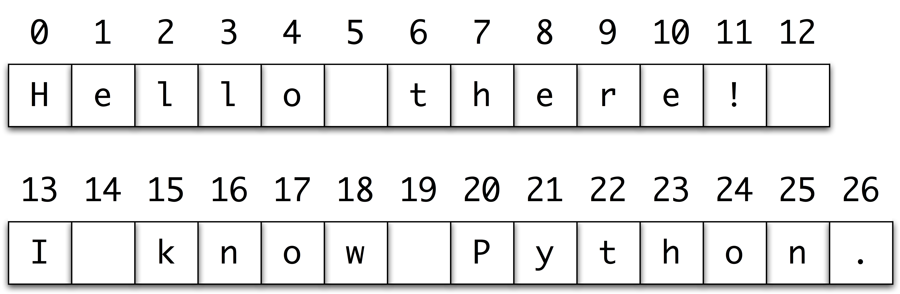

<BR>

|:-------:|
| <span style="font-size: 100%"><b>_-- A Python Course for the Humanities by Folgert Karsdorp and Maarten van Gompel_</b></span>|

# Sentence Tokenization

In the previous chapter we wrote a function to tokenize or split a text string into a list of words. However, using this function we lose information about where sentences end and start in the text. We will develop a function `split_sentences` that performs some very simple sentence splitting when passed a text string. Each sentence will be represented as a new string, so the function as a whole returns a list of sentence strings. We assume that any occurrence of either `.` or `!` or `?` marks the end of a sentence. In reality, this is more ambiguous of course. Consider for example the use of periods as end-of-sentence marker as well as in abbreviations and initials!

How should we tackle this problem? Have a look at the following picture:



The first sentence *Hello there!* spans from index 0 to index 11. The second sentence from 13 to 26. If we come up with a way to extract those indexes, we could slice the text into separate sentences. First we define a utility function `end_of_sentence` that takes as argument a character and returns `True` if it is an end-of-sentence marker, otherwise it returns `False`. 


# Quiz!

Write the function `end_of_sentence_marker` below:


```python
def end_of_sentence_marker(character):
    # insert your code here

# these tests should return True if your code is correct
print(end_of_sentence_marker("?") == True)
print(end_of_sentence_marker("a") == False)
```

---

An important function we will use is the built in `enumerate`. `enumerate` takes as argument any iterable (a string a list etc.). Let's see it in action:

```python
for element in enumerate("Python"):
    print(element)
```

As you can see, enumerate allows you to iterate over an iterable and for each element in that iterable, it gives you its corresponding index. A slightly more convenient way of iterating over `enumerate` is the following:

```python
for index, character in enumerate("Python"):
    print(index)
```

This way, we have easy access to both the index and the original item in the iterable. Now we know enough to write our `split_sentences` function. We will walk you through it, step by step, but first try to read the function and think about what it possibly does at each step:

```python
def split_sentences(text):
    "Split a text string into a list of sentences."
    sentences = []
    start = 0
    for end, character in enumerate(text):
        if end_of_sentence_marker(character):
            sentence = text[start: end + 1]
            sentences.append(sentence)
            start = end + 1
    return sentences
```

The function `split_sentences` takes as argument a text represented by a simple string. Within the function we define a variable `sentences` in which we will store the individual sentences. We need to extract both the start position and the end position of each sentence. We know that the first sentence will always start at position 0. Therefore we define a variable start and set it to zero.

Next we will use `enumerate` to loop over all individual characters in the text. Remember that enumerate returns pairs of indexes and their corresponding elements (here characters). For each character we check whether it is an end-of-sentence marker. If it is, the variable `end` marks the position in `text` where a sentence ends. We can now slice the text from the starting position to the end position and obtain our sentence. Notice that we add 1 to the end position. Why would that be? This is because, as you might remember from the first chapter, slices are non-inclusive, so `text[start:end]` would return the text starting at `start` and ending one position before `end`. Since we have reached the end of a sentence, we know that the next sentence will start at least one position later than our last end point. Therefore, we update the start variable to `end + 1`. Let's check whether our function works as promised:


```python
print(split_sentences("This is a sentence. Should we seperate it from this one?"))
```

It does! 

# Quiz!

To conclude this section, you will write a wrapper function `tokenize`, that takes as input a text represented by a string and tokenizes this string into sentences. After that, we clean each sentence, by lowercasing all words and removing punctuation. The final step is to tokenize each sentence into a list of words. The file `preprocessing.py` contains a function called `clean_text` which removes all punctuation from a text and turns all characters to lowercase. We import that function using the following line:

```python
from pyhum.preprocessing import clean_text
```

```python
def tokenize(text):
    """Transform TEXT into a list of sentences. Lowercase 
    each sentence and remove all punctuation. Finally split each
    sentence into a list of words."""
    # insert your code here

# these tests should return True if your code is correct
print(tokenize("This is a sentence. So, what!") == 
      [["this", "is", "a", "sentence"], ["so", "what"]])
```

<BR>

----

[Python Programming for the Humanities](http://fbkarsdorp.github.io/python-course) is licensed under a [Creative Commons Attribution-ShareAlike 4.0 International License](https://creativecommons.org/licenses/by-sa/4.0/). Based on a work at https://github.com/fbkarsdorp/python-course.


