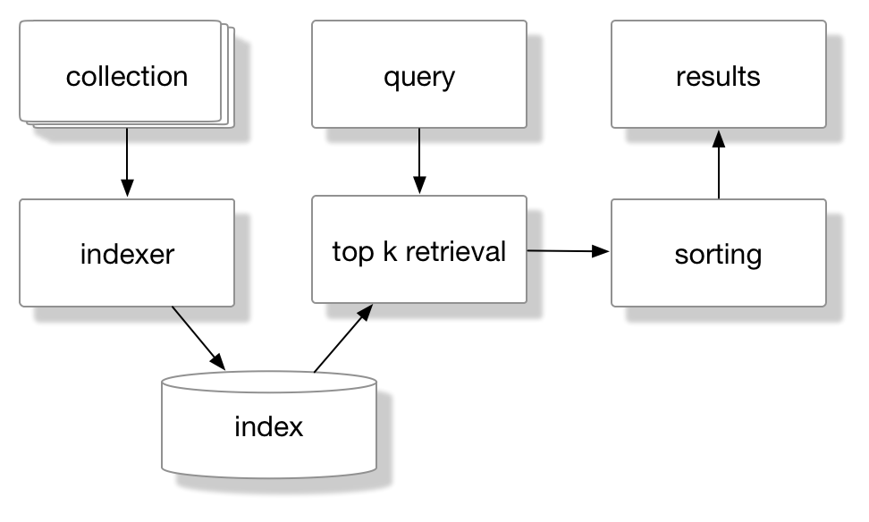

 

|:-------:|
| <b>_-- A Python Course for the Humanities by Folgert Karsdorp and Maarten van Gompel_</b>|

# Indexing Collections of Text

> Information Retrieval (IR) is finding material (usually documents) of an unstructured nature (usually text) that satisfies an information need from within large collections (usually stored on computers. (Manning, NLP course, coursera)

The field of Information Retrieval (IR) deals with developing techniques that allow users to efficiently search through large collections (of text) to find documents that are relevant to the question a particular user has. These days we almost immediately think of *web search* in the context of IR, but there are many other use case scenarios, such as E-mail search, searching for music (e.g. Spotify) or searching for content on your laptop. 

 

 

Most search models in Information Retrieval are similar to the schema above. We have a collection of items, text documents, for example, that are indexed using an indexer with a particular indexing schema. Given a user query, the index is used to retrieve $k$ documents which, after scoring and sorting, are presented to the user. This might seem all a little abstract, but it will all become clear once we start implementing our own IR system.

Consider a newspaper collection covering the complete 20th century. In this collection we would like to find all documents that mention [Albert Einstein](https://en.wikipedia.org/wiki/Albert_einstein) and [Edwin Hubble](https://en.wikipedia.org/wiki/Edwin_Hubble) but not [Enrico Fermi](https://en.wikipedia.org/wiki/Enrico_Fermi). Those of you familiar with the unix search tool [grep](https://en.wikipedia.org/wiki/Grep) might argue that we could simply use grep to search for all documents that contain both Einstein and Hubble and then filter out those documents that mention Fermi. 

# Quiz!

Come up with at least two reasons why searching with grep is not a good option.

*Double click this cell and write down your answer.*

 

----

[Python Programming for the Humanities](http://fbkarsdorp.github.io/python-course) is licensed under a [Creative Commons Attribution-ShareAlike 4.0 International License](https://creativecommons.org/licenses/by-sa/4.0/). Based on a work at https://github.com/fbkarsdorp/python-course.

